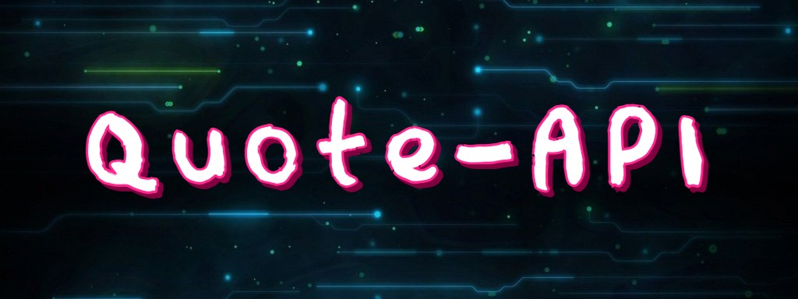

### quotes-from-all-over-the-world API
This api is created with Ruby on rails using postgresql. we bring you over 59,000 world famous quotes with authors and their genre completely free.


## Here is the quote API
[https://quotes-from-all-over-the-world.herokuapp.com/api/v1/quotes](https://quotes-from-all-over-the-world.herokuapp.com/api/v1/quotes)

# API Documentation

Supported languages: English

## Public routes

GET [`/api/v1/quotes`](https://quotes-from-all-over-the-world.herokuapp.com/api/v1/quotes) (get all quotes)
 - With params we can use /quotes?page=2, /quotes?per=3
 - We can search by name of author or quote like /quotes?search=life

#### That's how GET /api/v1/quotes look like

 ```sh
   { "quotes":
     [
       {
         "id":24483,
         "quote_text":"006 was such an interesting character and the film really explored his friendship with Bond and how it all went wrong, so it was a very personal journey for both characters.",
         "quote_author":"Sean Bean",
         "quote_genre":"friendship",
         "author_id":7617
       }
     ],
     "meta":
       {
         "page":0,
         "per":30,
         "nb_pages":1976,
         "total_quotes":59271,
         "search":null
       }
   }
 ```

GET [`/api/v1/quotes/2`](https://quotes-from-all-over-the-world.herokuapp.com/api/v1/quotes/2) (get quote show single by id))

#### That's how GET /api/v1/quotes/1 look like

```sh
  {
    "id":1,
    "quote_text":"All diseases run into one, old age.","quote_author":"Ralph Waldo Emerson",
    "quote_genre":"age",
    "author_id":1
  }
```

GET [`/api/v1/quotes/random`](https://quotes-from-all-over-the-world.herokuapp.com/api/v1/quotes/random) (get random quote))
  - By default it shows one quote. With params we can use /quotes/random?nb=2 to get any number of quotes

#### That's how GET /api/v1/quotes/random look like

  ```sh
    {
      "random_quote":
        [
          {
            "id":3243,
            "quote_text":"Light in Nature creates the movement of colors.",
            "quote_author":"Robert Delaunay",
            "quote_genre":"art",
            "author_id":922
          }
        ]
    }
  ```

GET [`/api/v1/authors`](https://quotes-from-all-over-the-world.herokuapp.com/api/v1/authors) (get all authors)
 - With params we can use /quotes?page=2, /quotes?per=3
 - We can search by name of author like /quotes?search=life

#### That's how GET /api/v1/authors look like

 ```sh
   [
     {"id":1175,"name":"Aaliyah"},
     {"id":3300,"name":"A. A. Milne"},
     {"id":8886,"name":"Aaron Allston"},
     {"id":7160,"name":"Aaron Carter"}
   ]
 ```

GET [`/api/v1/authors/1`](https://quotes-from-all-over-the-world.herokuapp.com/api/v1/authors/1) (get author show single by id)

#### That's how GET /api/v1/authors/1 look like

```sh
  {
    "id":1,
    "name":"Ralph Waldo Emerson"
  }
```
GET [`/api/v1/authors/random`](https://quotes-from-all-over-the-world.herokuapp.com/api/v1/authors/random) (get random authors))
  - By default it shows two authors. With params we can use /authors/random?nb=2 to get any number of authors
  - You can use reject_id params for the author which you don't want to get in random list like /authors/random?reject_id=31

#### That's how GET /api/v1/authors/random look like

```sh
  {
    "random_authors":
      [
        {"id":5788,"name":"Luigi Pirandello"},
        {"id":8341,"name":"Melinda Clarke"}
      ]
  }
```


<!-- ## GET /api/v1/quotes photo -->
