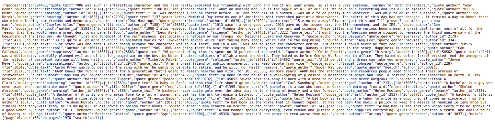

# quotesapi
### quotes-from-all-over-the-world API
#### This api is created with Ruby on rails using postgresql. To understand this api, follow the instructions

[Lets go to Quote-api](https://quotes-from-all-over-the-world.herokuapp.com/api/v1/quotes)

## API Documentation

Suported languages: en, sr.

### Public routes

GET [`/api/v1/quotes`](https://quotes-from-all-over-the-world.herokuapp.com/api/v1/quotes) (get all quotes)
* With params we can use /quotes?search=hama, /quotes?page=2, /quotes?per=3

<!-- 
#### GET /api/v1/quotes (get all quotes)
#### GET /api/v1/quotes/2 (get quote show by id)
#### GET /api/v1/quotes/random (get random quote)
* By default it shows one quote. With params we can use /quotes/random?nb=2 for limiting quotes
 -->


## GET /api/v1/quotes

### Returns all quotes of known author:




### thats how it look like the index of quotes

```sh
  { "quotes":
    [
      {
        "id":24483,
        "quote_text":"006 was such an interesting character and the film really explored his friendship with Bond and how it all went wrong, so it was a very personal journey for both characters.",
        "quote_author":"Sean Bean",
        "quote_genre":"friendship",
        "author_id":7617
      }
    ],
    "meta":
      {
        "page":0,
        "per":30,
        "nb_pages":1976,
        "search":null
      }
  }
```
## we can use you Get /quotes with three parameters
* /qoutes?page
* /qoutes?per
* /qoutes?search
